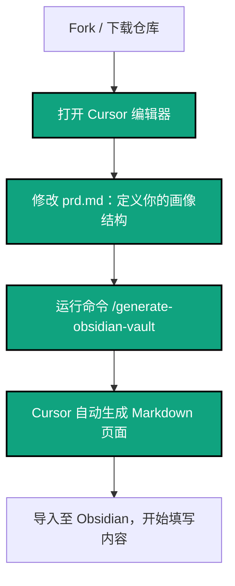
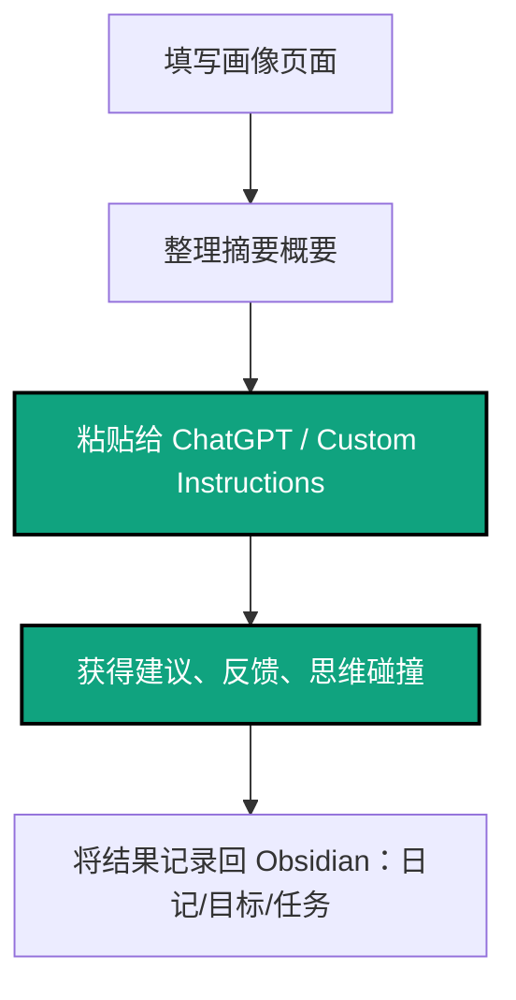
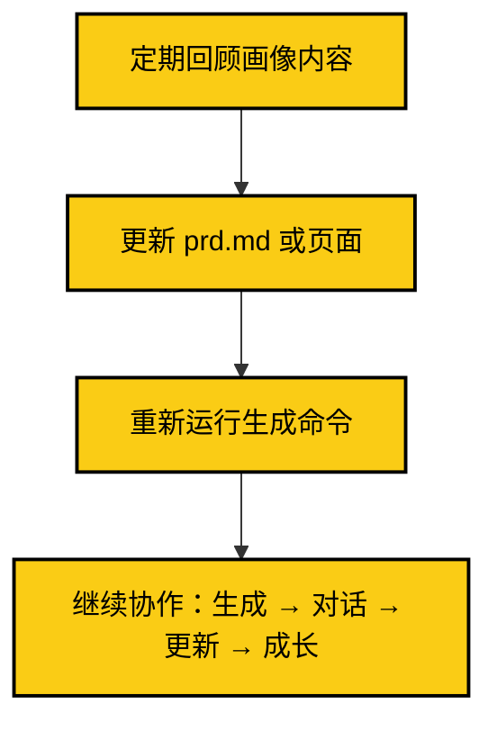

# 🧠 ai-powered-second-brain-cn

> **Cognitive OS：你的个人认知操作系统**
>
> 基于 Obsidian + ChatGPT 构建的智能认知系统，让 AI 成为你的思维外脑

本项目专为中文用户设计，后续将发布英文国际版：`ai-powered-second-brain`（敬请关注）

---

## 🧠 Cognitive OS：重新定义个人知识管理

> **这不是一个模板项目，而是一个完整的认知操作系统（Cognitive OS）**
>
> 就像计算机需要操作系统来管理硬件和软件一样，你的思维也需要一个操作系统来管理知识、记忆和认知过程。

### 🎯 Cognitive OS 核心理念

**Cognitive OS = 你的大脑 + Obsidian（记忆容器）+ ChatGPT（思维外脑）+ PRD（系统配置）**

- 🧠 **思维外脑**：将 ChatGPT 视为你的外部认知处理器，提供思维碰撞、创意激发、逻辑分析
- 💾 **记忆容器**：Obsidian 作为你的长期记忆存储，结构化保存所有认知资产
- ⚙️ **系统配置**：PRD.md 作为操作系统的配置文件，定义你的认知架构
- 🔄 **认知闭环**：实现"输入 → 处理 → 存储 → 输出 → 反馈"的完整认知循环

### 🚀 Cognitive OS 核心特性

- 🪄 **Zero‑Template, One‑Command**：使用 Cursor 一条命令 `/generate-obsidian-vault`，动态生成完整认知架构
- 🚀 **规则驱动式生成**：避免手动维护模板，所有认知结构可由 AI 根据你的需求实时生成
- 🧩 **自我画像系统**：构建完整的个人认知模型，作为所有思维活动的基础数据
- 🔁 **持续进化**：系统会随着你的成长而不断优化和扩展

---

## 🧭 项目目录结构

```

ai-powered-second-brain-cn/
├── README.md                # 中文项目说明与使用引导
├── prd.md                   # 产品需求说明文档（供 GPT 使用）
├── 画像摘要模板.md          # 提供给 ChatGPT 的个人画像概要结构
├── chatgpt-workflow\.md      # 工作流说明 + Mermaid 图
├── .cursor/
│   └── rules/
│       └── generate-obsidian-vault.rule  # 规则驱动式生成器
├── personal-vault-template/ # （可选）静态模板，亦可不使用
│   ├── 00-索引.md
│   ├── 01-基本信息.md
│   ├── ...
├── README.en.md             # 英文版占位（待发布）
├── LICENSE
└── og-image.png             # GitHub 社交预览图

```

---

## 📌 项目内容简介

本项目旨在帮助中文用户：

- 利用 Obsidian 构建结构化的个人画像系统
- 总结画像摘要用于 ChatGPT 协作
- 获取个性化建议（如目标规划、写作反馈、自我反思）
- 构建 Obsidian 与 ChatGPT 协同闭环，持续自我成长

---

## 🌟 Cognitive OS vs 传统知识管理

### 🆚 与传统项目的根本差异

| 传统知识管理    | Cognitive OS 认知操作系统 |
| --------------- | ------------------------- |
| 📝 静态模板集合 | 🧠 动态认知系统           |
| 🔧 工具导向     | 🎯 认知导向               |
| 📚 知识存储     | 🔄 认知循环               |
| 🤖 AI 作为工具  | 🧠 AI 作为外脑            |
| 📋 手动维护     | ⚙️ 自动生成               |

### 🚀 Cognitive OS 独特优势

- 🎯 **认知导向设计**：以提升认知能力为核心，而非简单的信息存储
- 🔁 **完整认知闭环**：实现“感知 → 思考 → 记忆 → 行动 → 反馈”的完整循环
- 🧠 **AI 思维外脑**：ChatGPT 成为你的外部认知处理器，而非简单的问答工具
- 🪄 **零模板自动化**：通过 PRD 配置，AI 自动生成完整的认知架构
- 🧰 **系统级集成**：Obsidian + ChatGPT + PRD 形成完整的认知操作系统

---

## ⚙️ 与 Cursor 协作使用指南

你可以通过以下两种方式快速生成完整个人画像结构：

### ✅ 推荐方式：使用规则文件自动生成

> **使用方法：**

1. 打开 [Cursor](https://cursor.sh)，新建项目
2. 将 `prd.md` 放入项目中
3. 打开命令面板，输入：

```

/gov: GenerateObsidianVault

```

4. Cursor 将根据规则读取 `prd.md`，自动生成完整 `personal-vault-template/` 文件夹

> ✨ 此方式可省去所有模板维护工作。PRD 更新一次，Vault 结构即刻重建一次。

---

### ✍️ 替代方式：使用静态模板

如果你更倾向于手动填写，可：

1. 克隆本仓库或下载 zip
2. 将 `personal-vault-template/` 文件夹导入 Obsidian 作为新 Vault
3. 根据模板逐页填写你的内容
4. 在 `画像摘要模板.md` 中维护你的核心画像概要
5. 粘贴概要给 ChatGPT（建议加入 Custom Instructions）

---

## 🧩 工作流总览（含 Cursor 自动生成）

本项目包含三大阶段，构成一个完整的认知操作系统（**Cognitive OS**）：

### 🛠️ A. 初始化阶段（结构生成）



---

### 🤖 B. ChatGPT 协作阶段（生成对话）



---

### 🔁 C. 成长闭环阶段（自我演进）



---

📌 这三个阶段构成你的**认知系统核心循环**：

> Cursor 管理结构（输入容器）
> Obsidian 承载内容（知识存储）
> ChatGPT 提供反馈（认知对话器）

这正是所谓的 **Cognitive OS：自我 + 工具 + AI 形成的高效反馈系统**。

---

## 🔧 推荐 Obsidian 插件（可选）

| 插件                                                                  | 作用                 |
| --------------------------------------------------------------------- | -------------------- |
| [Templater](https://github.com/SilentVoid13/Templater)                | 快速插入字段结构     |
| [Dataview](https://github.com/blacksmithgu/obsidian-dataview)         | 动态展示画像聚合信息 |
| [Periodic Notes](https://github.com/liamcain/obsidian-periodic-notes) | 周/月度回顾整合      |
| [Excalidraw](https://github.com/zsviczian/obsidian-excalidraw-plugin) | 图像化表达自我理解   |

---

## 📃 许可协议

MIT License © 2025 \[LolipopAI]

---

如果你喜欢这个项目，请点个 ⭐️ star 支持，并分享给你的朋友！

如你愿意贡献英文版，请关注即将发布的国际仓库：**ai-powered-second-brain** 🙌
