以下是将「Obsidian 个人画像 + ChatGPT 协作」的使用流程整理成工作流的方式，并通过 Mermaid 生成流程图。

🧠 工作流目标：

- 使用 Obsidian 构建并维护个人画像；
- 使用摘要为 ChatGPT 提供上下文，获得个性化回应；
- 形成一个闭环，持续反思和更新画像。

📋 工作流步骤说明：

1. 建立 Obsidian Vault，使用模板填写各类信息（技能、兴趣、目标等）；
2. 定期整理出一个「个人画像摘要」页面；
3. 使用摘要作为 ChatGPT 对话的上下文引导（贴入 prompt 或写入 Custom Instructions）；
4. 与 ChatGPT 对话中获得反思、建议或内容创作辅助；
5. 将有价值的 ChatGPT 输出记录回 Obsidian 日记或画像中；
6. 每月/季度回顾画像并更新摘要，形成知识与自我认知的增长循环。

🧭 Mermaid 流程图（可复制粘贴到 Obsidian 中使用）

```mermaid
flowchart TD
    A[建立 Obsidian 个人画像] --> B[填写各主题页面]
    B --> C[生成个人画像摘要]
    C --> D[将摘要粘贴给 ChatGPT 或写入 Custom Instruct]
    D --> E[获得个性化建议/反思/协作]
    E --> F[将重要内容记录回 Obsidian<br/>如日记、目标更新]
    F --> G[定期回顾与更新画像摘要]
    G --> C

    %% 颜色样式定义
    classDef obsidian fill:#663399,stroke:#333,stroke-width:2px,color:#fff
    classDef chatgpt fill:#10a37f,stroke:#333,stroke-width:2px,color:#fff
    classDef general fill:#e1f5fe,stroke:#333,stroke-width:2px,color:#000

    %% 应用颜色
    class A,B,C,F,G obsidian
    class D,E chatgpt
```

🎯 小提示：

- 可以使用 Dataview 自动引用相关内容到摘要；
- 也可以在 Daily Note 中用模板自动引用「摘要」；
- ChatGPT 可配合角色指令，例如：「你是我的成长教练，请基于以下画像帮我规划下半年学习目标」。
